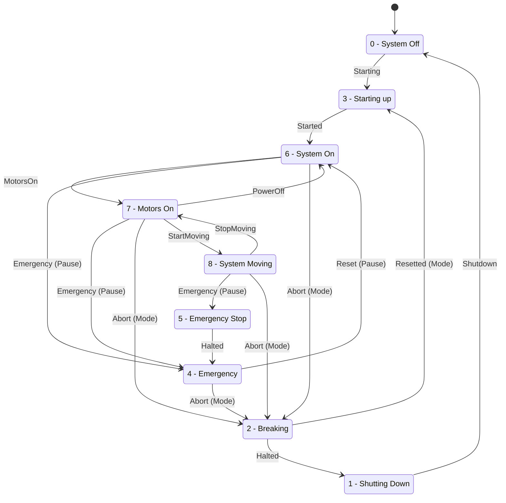

# EEROS Project during Class

## Safety-Properties

| # | Name           | R | G | 0 | 1 |
|---|----------------|---|---|---|---|
| 0 | System Off     |   |   |   |   |
| 1 | Shutting down  | x |   |   |   |
| 2 | Breaking       | x |   | x |   |
| 3 | Starting up    |   | x |   |   |
| 4 | Emergency Mode | x |   |   |   |
| 5 | Emergency Stop | x |   | x |   |
| 6 | System On      |   | x |   |   |
| 7 | Motors On      |   | x |   | x |
| 8 | System running |   | x |   | x |

* **Pause-Button**: Reset Emergency
* **Mode-Button**: Emergency

